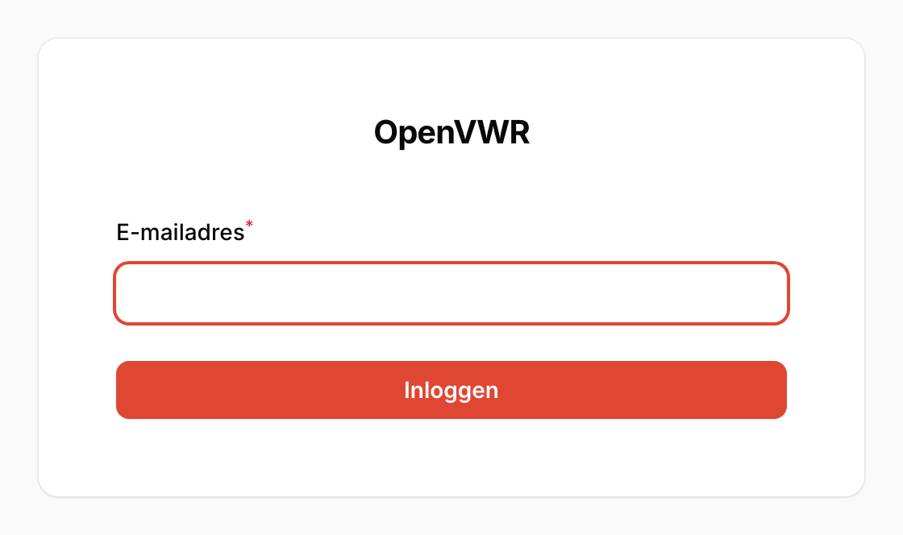
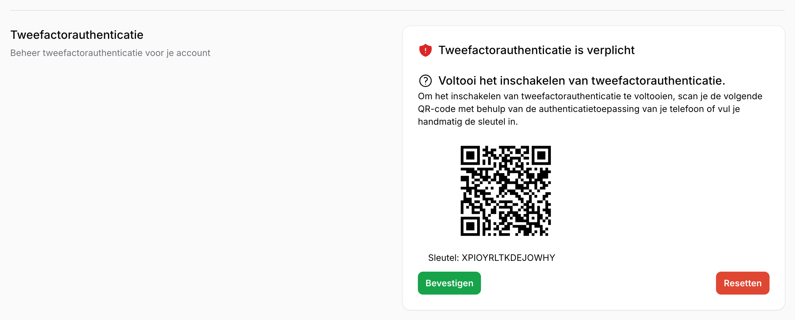

# Welkom

OpenVWR is het centrale platform waarmee organisaties alle verwerkingen van persoonsgegevens kunnen bijhouden, laten goedkeuren en publiceren. Dit document is de bijbehorende handleiding.

## Over OpenVWR

OpenVWR is een webapplicatie met formulieren die een eenduidige en gestructureerde invulling van het verwerkingsregister faciliteert. De belangrijkste functionaliteiten:

- Toegankelijk voor medewerkers van de gehele organisatie, inclusief onderliggende organisatieonderdelen.
- Importfunctionaliteit voor bestaande registers, met de mogelijkheid geïmporteerde gegevens handmatig aan te vullen.
- Koppeling van documenten aan een verwerking, waarbij deze documenten ook in het systeem opgeslagen worden.
- Een administratieportaal voor gebruikers en daaraan gerelateerde rollen en rechten.
- Online waarschuwingen bij (binnenkort) verlopen documenttermijnen, bijvoorbeeld van DPIA's.
- Registratie van algoritmes, als een bijzondere vorm van verwerkingen.
- Een datalekregister waar Privacy Officers datalekken kunnen registreren, exporteren en eventueel kunnen melden bij de Chief Privacy Officer.
- Vastlegging van relaties tussen entiteiten en (sub)verwerkingen, met geautomatiseerde voorgestelde veranderingen.
- Alerting, bijvoorbeeld een email wanneer een document zijn geldigheid gaat verliezen of wanneer een taak voor een gebruiker klaar staat.

## Details

Generieke informatie omtrent OpenVWR:

- website: [https://openvwr.nl/](https://openvwr.nl/)
- codebase: PHP, Laravel, Filament
- helpdesk: neem contact op met uw Chief Privacy Officer

## Inloggen

Voor toegang tot OpenVWR zult u moeten beschikken over een account en een authenticator applicatie.

### Een account op OpenVWR

Voordat u in kunt loggen heeft u een account nodig: neem hiervoor contact op met uw Chief Privacy Officer.

### Een authenticator applicatie

De applicatie is beschermd met 2 Factor Authentication, ook wel bekend als One Time Password protection. Hiervoor heeft u een van de volgende apps nodig op uw mobiele device:

 1. Microsoft Authenticator: [Android App](https://play.google.com/store/apps/details?id=com.azure.authenticator&hl=nl&gl=US) / [iPhone App](https://apps.apple.com/nl/app/microsoft-authenticator/id983156458)
 2. Google Authenticator: [Android App](https://play.google.com/store/apps/details?id=com.google.android.apps.authenticator2) / [iPhone App](https://apps.apple.com/nl/app/google-authenticator/id388497605)
 3. FreeOTP Authenticator: [Website](https://freeotp.github.io/)

### De authenticator instellen

Tweefactorauthenticatie is verplicht. Zolang u deze nog niet heeft ingesteld, brengt OpenVWR u na het inloggen automatisch naar de pagina "Mijn profiel" (Figuur \ref{fig:authenticator_instellen}). U kunt de rest van de applicatie pas gebruiken nadat u deze stap heeft afgerond; het is dus niet mogelijk deze pagina over te slaan.

Op deze pagina stelt u de authenticator als volgt in:

 1. Klik op "Inschakelen". Er verschijnt een QR-code met daaronder een sleutel, zoals in Figuur \ref{fig:authenticator_instellen}.
 2. Scan de QR-code met de authenticator applicatie op uw mobiele device. Kan uw device geen QR-code scannen, dan voert u de getoonde sleutel handmatig in de applicatie in.
 3. Klik op "Bevestigen" en vul de code van zes cijfers in die uw authenticator applicatie toont.

Met de knop "Resetten" begint u de instelling opnieuw; er wordt dan een nieuwe QR-code met een nieuwe sleutel aangemaakt.

Na een geldige code is de tweefactorauthenticatie ingeschakeld en heeft u toegang tot de applicatie. Voert u een onjuiste code in, dan meldt de applicatie dat en kunt u het opnieuw proberen.

### Inloggen met de authenticator

Zodra de authenticator is ingesteld, verloopt het inloggen bij iedere volgende sessie in twee stappen. Eerst logt u in met uw e-mailadres, waarna u een tweefactorscherm krijgt waarin u de actuele code van zes cijfers uit uw authenticator applicatie invult. De code wisselt periodiek: neem daarom altijd de code over die op dat moment in de applicatie zichtbaar is.

Beschikt u niet meer over uw authenticator applicatie, bijvoorbeeld na de aanschaf van een nieuw mobiel device, neem dan contact op met uw Chief Privacy Officer of een beheerder. Deze kan uw tweefactorauthenticatie resetten, waarna u bij de eerstvolgende keer inloggen opnieuw de stappen uit de vorige paragraaf doorloopt.
