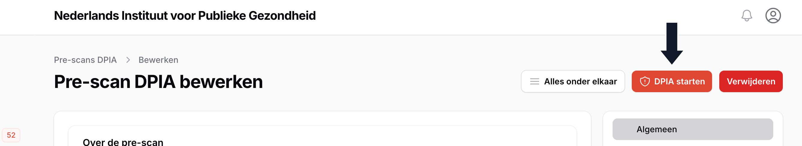
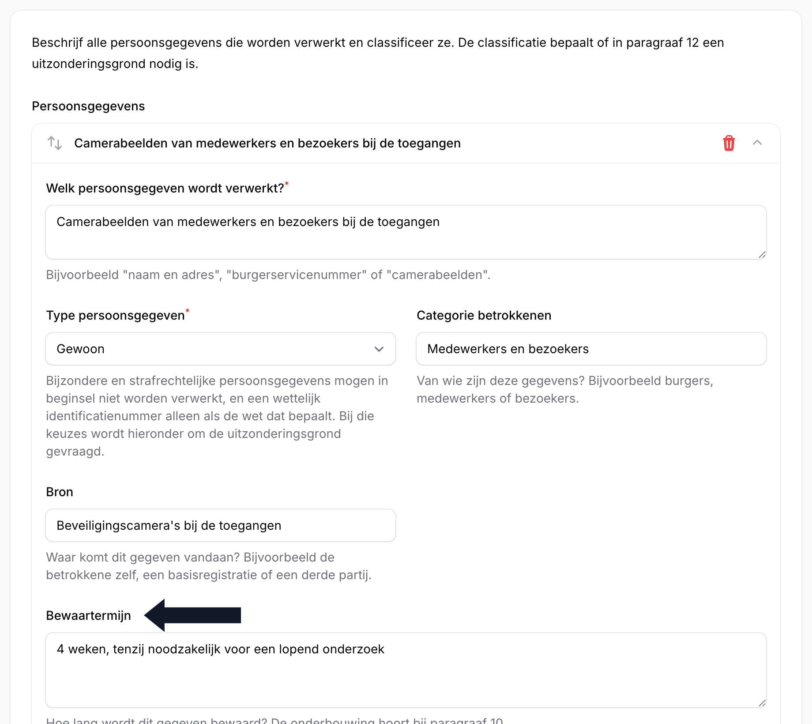

# DPIA\label{DPIA}

Naast de verwerkingsregisters kent OpenVWR een apart onderdeel voor het uitvoeren van een gegevensbeschermingseffectbeoordeling (DPIA) bij verwerkingen met een hoog privacyrisico. Dit onderdeel staat in het navigatiemenu onder "DPIA", direct onder de verwerkingsregisters, en bestaat uit twee registers: de Pre-scan DPIA en de DPIA zelf.

## Pre-scan DPIA

**Beschikbaar voor**: Invoerder, (Chief) Privacy Officer, Raadpleger (lezen), Functionaris Gegevensbescherming (lezen), Mandaathouder (lezen)

Een Pre-scan DPIA is een korte toets waarmee u bepaalt of voor een verwerking een volledige DPIA nodig is. Dezelfde toets bepaalt meteen ook of er een DTIA (bij internationale doorgifte), een KIA (kinderrechten) of een IAMA (algoritmes en hoogrisico-AI) vereist is.

> **Hint**: De Pre-scan DPIA wordt altijd bewaard, ook als de uitkomst is dat er geen DPIA nodig is. Zo houdt u een verantwoording bij van de afweging die is gemaakt.

Is de uitkomst dat een DPIA verplicht of aanbevolen is, dan verschijnt op de detailpagina van de Pre-scan DPIA de knop "DPIA starten" (Figuur \ref{fig:dpia_prescan_starten}). Hiermee maakt u een nieuwe DPIA aan waarin de naam, omschrijving en gekoppelde verwerkingen al zijn overgenomen.

> **Let op**: Een Pre-scan DPIA doorloopt zelf geen goedkeuringsproces: er is geen knop "Versie aanmaken" en geen status. Voor de DPIA die u eruit start, geldt dat wel; zie Hoofdstuk \ref{Goedkeuringsproces}, "Goedkeuringsproces".

## DPIA

**Beschikbaar voor**: Invoerder, (Chief) Privacy Officer, Raadpleger (lezen), Functionaris Gegevensbescherming (lezen), Mandaathouder (lezen)

Een DPIA is de volledige gegevensbeschermingseffectbeoordeling, opgebouwd volgens de paragrafen van het Rijksmodel. Net als bij de verwerkingsregisters doorloopt u op het invoerformulier een aantal stappen, van de algemene gegevens tot en met een samenvatting en opmerkingen.

Een van de belangrijkste onderdelen is de paragraaf **Persoonsgegevens**. Hier legt u per gegeven vast om welk type het gaat (gewoon, gevoelig, bijzonder, strafrechtelijk of een identificatienummer), wat de categorie betrokkenen en de bron zijn, en wat de bewaartermijn is (Figuur \ref{fig:dpia_persoonsgegevens}).

Gaat het om bijzondere persoonsgegevens, strafrechtelijke gegevens of een identificatienummer, dan vult u daarbij verplicht een uitzonderingsgrond in.

> **Hint**: De bewaartermijn werkt hier op precies dezelfde manier als bij een verwerking: zie Hoofdstuk \ref{Beheer}, "Bewaartermijnen".

Verderop in het formulier legt u de risico's vast, elk met een inschatting van kans en impact, en de maatregelen die een risico beperken. Blijft na het nemen van maatregelen een hoog restrisico over, dan wijst OpenVWR erop dat een voorafgaande consultatie van de Autoriteit Persoonsgegevens verplicht is; dit legt u vast bij de paragraaf **Consultatie**. Bij **Review** geeft u aan wanneer de DPIA opnieuw beoordeeld moet worden; hanteer hierbij een termijn van maximaal drie jaar.

Een DPIA doorloopt, net als een verwerking, het volledige goedkeuringsproces met versies: zie Hoofdstuk \ref{Goedkeuringsproces}, "Goedkeuringsproces". Ook is een DPIA te dupliceren en te voorzien van labels, op dezelfde manier als beschreven in Hoofdstuk \ref{Labels}, "Labels".

> **Let op**: Anders dan bijvoorbeeld verwerkingen is een DPIA niet te publiceren op de publieke website.
