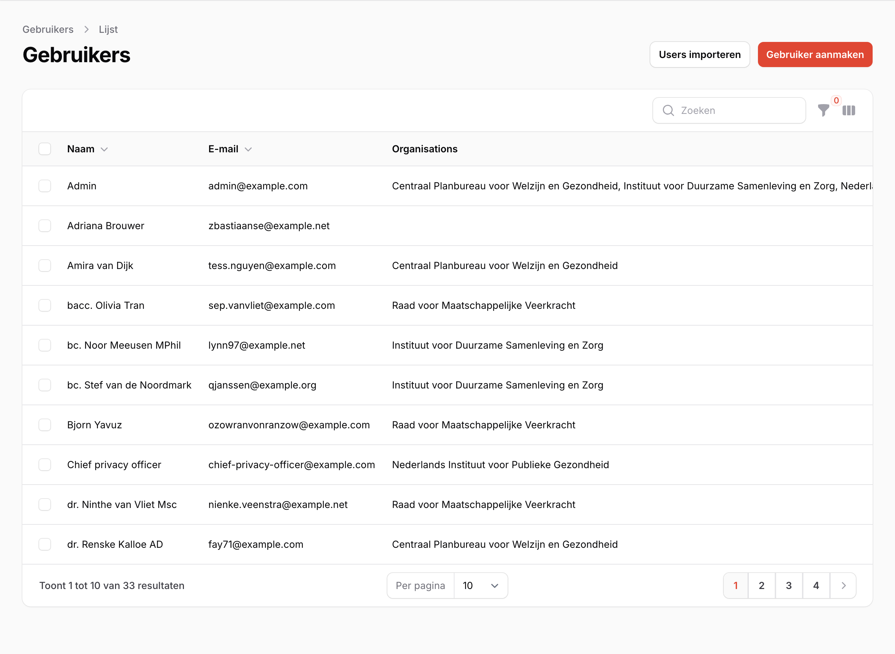

# Beheer\label{Beheer}

Het beheren van de applicatie bestaat uit het beheren van gebruikers binnen de organisatie.

## Gebruikers

**Beschikbaar voor**: (Chief) Privacy Officer

Binnen de Organisatie zijn Gebruikers te beheren: nieuwe gebruikers kunnen uitgenodigd worden, van bestaande gebruikers kunnen de rollen worden gewijzigd en gebruikers kunnen verwijderd worden. Gebruikersbeheer staat in het navigatiemenu onder Organisaties.

### Gebruikers toevoegen

Rechtsboven de gebruikerstabel is de knop om gebruikers toe te voegen. Als een gebruiker is toegevoegd zal deze een welkomst email toegestuurd krijgen met de link naar het verwerkingsregister.

### Gebruikers aanpassen / verwijderen

Klik op een gebruiker in de tabel om een gebruiker te wijzigen (Figuur \ref{fig:gebruikers_beheer}). Op deze pagina kunnen rollen worden aangepast en opgeslagen. Het verwijderen van een gebruiker kan met de rode knop rechtsbovenin.
