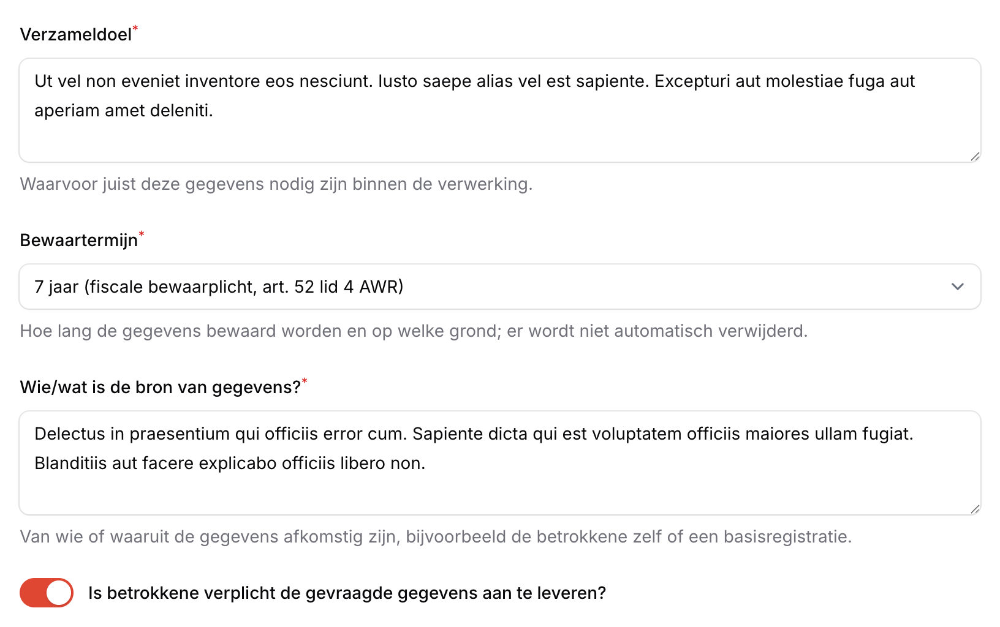
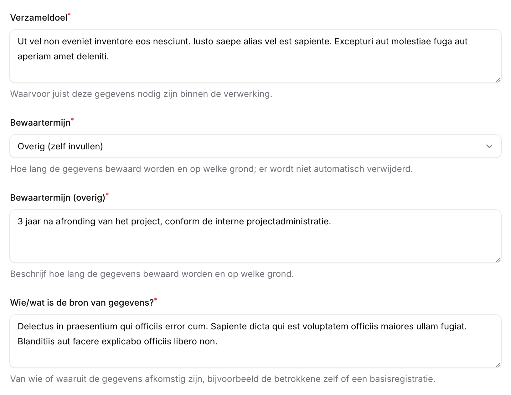

# Beheer\label{Beheer}

Het beheren van de applicatie bestaat uit het beheren van gebruikers en bewaartermijnen binnen de organisatie.

## Gebruikers

**Beschikbaar voor**: (Chief) Privacy Officer

Binnen de Organisatie zijn Gebruikers te beheren: nieuwe gebruikers kunnen uitgenodigd worden, van bestaande gebruikers kunnen de rollen worden gewijzigd en gebruikers kunnen verwijderd worden. Gebruikersbeheer staat in het navigatiemenu onder Organisaties.

### Gebruikers toevoegen

Rechtsboven de gebruikerstabel is de knop om gebruikers toe te voegen. Als een gebruiker is toegevoegd zal deze een welkomst email toegestuurd krijgen met de link naar OpenVWR.

### Gebruikers aanpassen / verwijderen

Klik op een gebruiker in de tabel om een gebruiker te wijzigen (Figuur \ref{fig:gebruikers_beheer}). Op deze pagina kunnen rollen worden aangepast en opgeslagen. Het verwijderen van een gebruiker kan met de rode knop rechtsbovenin.

## Bewaartermijnen

**Beschikbaar voor**: Invoerder, (Chief) Privacy Officer

Bij de gegevens van een categorie betrokkenen, en bij de persoonsgegevens in een DPIA, vult u per gegeven een bewaartermijn in. De termijnen waaruit u kunt kiezen beheert u als opzoeklijst *Bewaartermijnen*; zie Hoofdstuk \ref{OverigeFuncties}, "Opzoeklijsten", voor het toevoegen, in- en uitschakelen van waarden.

Een bewaartermijn legt vast hoe lang u gegevens bewaart en op grond waarvan. Dat is een verantwoording over een verwerking zoals die op dat moment gold, en niet louter een etiket dat u er later anders op kunt plakken. Werkt u de lijst bij omdat het beleid verandert, dan verandert daarmee niet met terugwerkende kracht wat u eerder heeft vastgelegd, en al helemaal niet in een register dat al is vastgesteld.

OpenVWR slaat de gekozen bewaartermijn daarom op als tekst bij het gegeven zelf, en niet als verwijzing naar de lijst. De lijst levert alleen de keuzemogelijkheden.

> **Let op**: Het aanpassen of verwijderen van een waarde in de lijst *Bewaartermijnen* verandert niets aan verwerkingen waarin die termijn al is ingevuld. Wilt u een eerder vastgelegde termijn wijzigen, dan doet u dat bij de verwerking zelf. Bij de andere opzoeklijsten werkt een wijziging wel door in de gekoppelde gegevens; die leggen een verwijzing vast in plaats van een tekst.

### Een bewaartermijn kiezen

Staan er termijnen in de lijst, dan kiest u er één uit de keuzelijst (Figuur \ref{fig:bewaartermijn_kiezen}).

Past geen van de termijnen, kies dan *Overig (zelf invullen)*. Er verschijnt een tekstveld waarin u de termijn zelf beschrijft (Figuur \ref{fig:bewaartermijn_overig}). Beschrijf daarbij niet alleen hoe lang de gegevens bewaard worden, maar ook op welke grond.

Is de lijst *Bewaartermijnen* nog leeg, dan wordt de keuzelijst niet getoond en vult u de termijn altijd zelf in. Termijnen die al eerder als vrije tekst zijn ingevuld blijven gewoon staan en zijn te wijzigen.

> **Hint**: Vult u vaak dezelfde termijn in, laat de (Chief) Privacy Officer deze dan toevoegen aan de lijst *Bewaartermijnen*. Bij een volgende verwerking is de termijn dan met één klik te kiezen.
