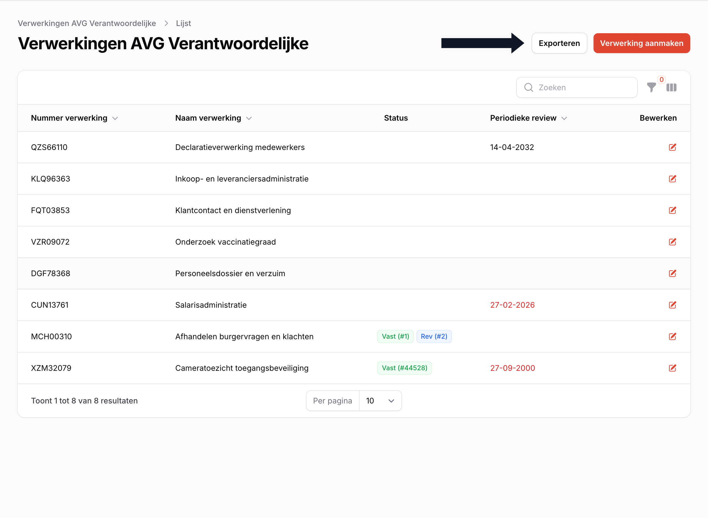
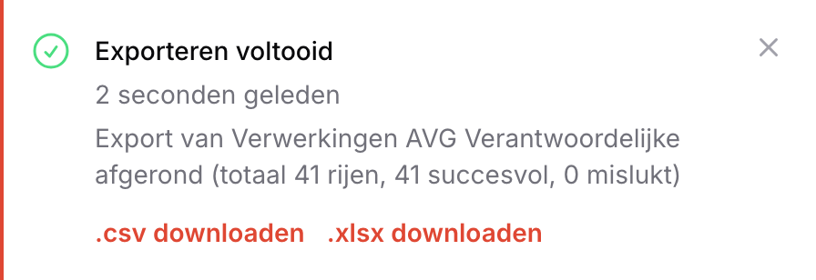
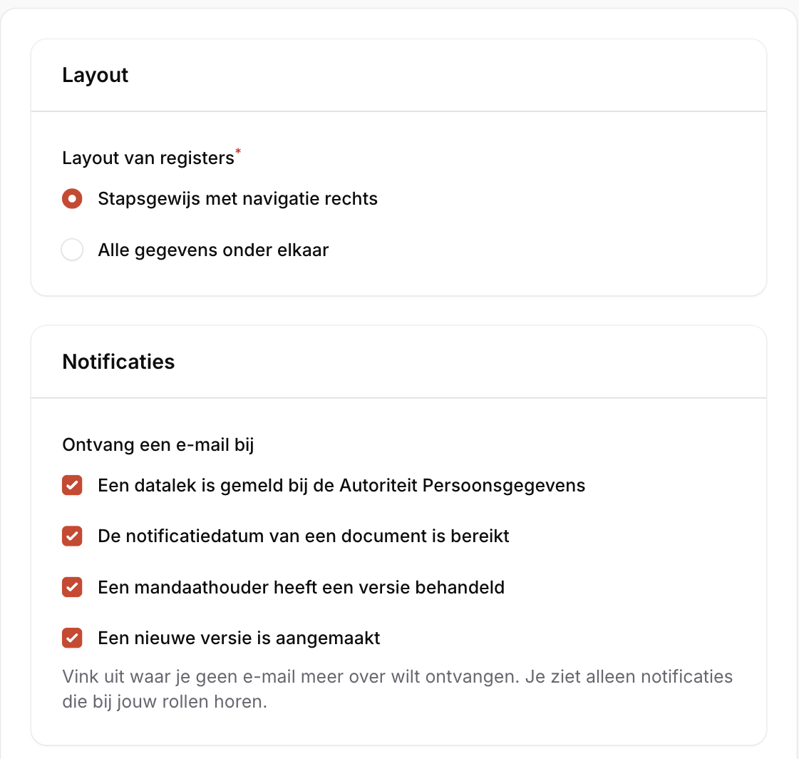
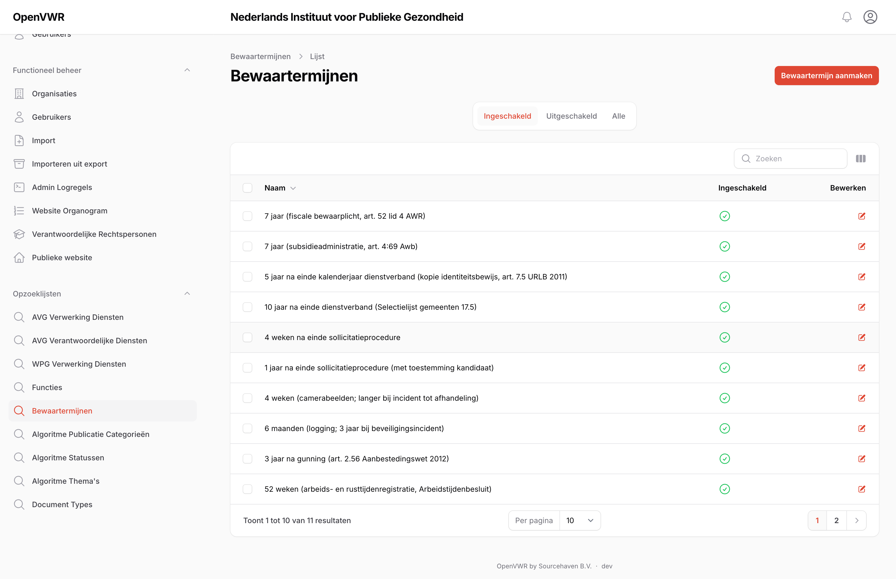
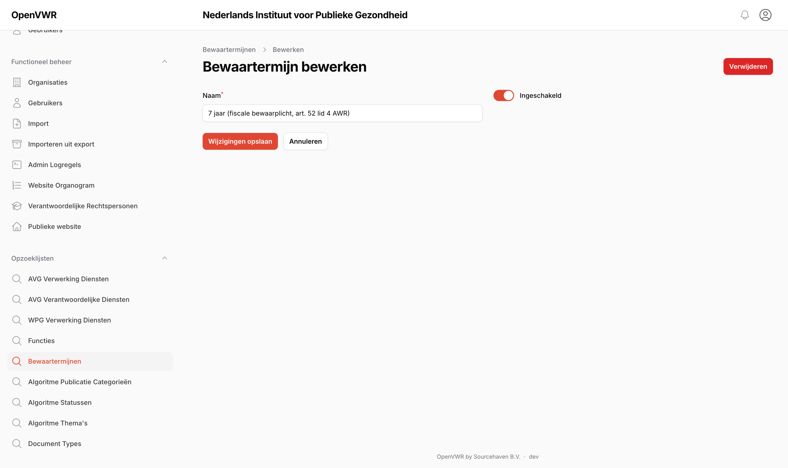

# Overige Functies\label{OverigeFuncties}

Het portaal biedt een aantal overige functies, zoals het importeren van een bestaand register of het exporteren naar sheets voor het maken van overzichten.

## Import

**Beschikbaar voor**: (Chief) Privacy Officer

Met de "import" functionaliteit leest u een bestaand register in. Komt uw register uit het [AVG Register Rijksoverheid](https://www.avgregisterrijksoverheid.nl/), dan zijn de zip-files die dat systeem exporteert direct te importeren.

## Export

**Beschikbaar voor**: (Chief) Privacy Officer, Functionaris Gegevensbescherming

OpenVWR biedt de mogelijkheid om registers te exporteren naar een `.csv` of `.xlsx` bestand. De knop voor het exporteren zit boven de overzichtstabel van ieder register (Figuur \ref{fig:export}).

Is de export voltooid, dan zal er een notificatie getoond worden in het scherm rechts bovenin. De links naar de files zijn te vinden in het notificatie-overzicht (Figuur \ref{fig:export_complete}).

## Notificaties\label{sec:notificaties}

**Beschikbaar voor**: iedereen die e-mails uit het portaal ontvangt

Het portaal stuurt e-mails op basis van de rollen die u heeft: een Privacy Officer krijgt bijvoorbeeld bericht als er een nieuwe versie is aangemaakt, en een Chief Privacy Officer als een datalek is gemeld bij de Autoriteit Persoonsgegevens. U bepaalt zelf welke van deze e-mails u wilt blijven ontvangen.

Deze instellingen staan onder "Profiel" > "Instellingen", in het blok "Notificaties" (Figuur \ref{fig:profiel_notificaties}).

Alle notificaties staan standaard aan. Vink een notificatie uit om er geen e-mail meer over te ontvangen; de wijziging geldt voor al uw organisaties. U ziet alleen de notificaties die bij uw eigen rollen horen: een notificatie die u toch niet zou ontvangen, wordt niet getoond.

> **Let op**: Het uitzetten van een notificatie heeft alleen effect op de e-mail. De onderliggende gebeurtenis blijft gewoon zichtbaar in het portaal, bijvoorbeeld in de overzichten van versies en datalekken.

## Opzoeklijsten

**Beschikbaar voor**: (Chief) Privacy Officer

In het systeem zijn er meerdere velden waar er slechts een keuze mogelijk is uit een beperkte set opties. Onder "Opzoeklijsten" zijn deze velden te vinden en zijn hun opties aan te passen (Figuur \ref{fig:opzoeklijst_overzicht}).

In deze opzoeklijsten zijn nieuwe waardes aan te maken, opties in of uit te schakelen en opties te verwijderen (Figuur \ref{fig:opzoeklijst_bewerken}). Op de detailpagina van een optie is een tabel te vinden van alle entiteiten waar deze optie is geselecteerd.

Met de tabs boven de tabel wisselt u tussen ingeschakelde en uitgeschakelde waarden. Alleen ingeschakelde waarden verschijnen in de keuzelijsten bij het invoeren.

> **Let op:** Het verwijderen van een optie verwijdert deze compleet uit het systeem! Dit betekent dat overal waar de optie geselecteerd was, nu niets meer geselecteerd is. Als dit niet de bedoeling is, wilt u de optie waarschijnlijk uitschakelen: de optie is dan niet meer te selecteren, maar entiteiten waar deze optie eerder geselecteerd was, blijven ongewijzigd.

De lijst *Bewaartermijnen* is hierop een uitzondering: wijzigingen daarin laten bestaande verwerkingen ongemoeid. Zie Hoofdstuk \ref{Beheer}, "Bewaartermijnen", voor de reden.
